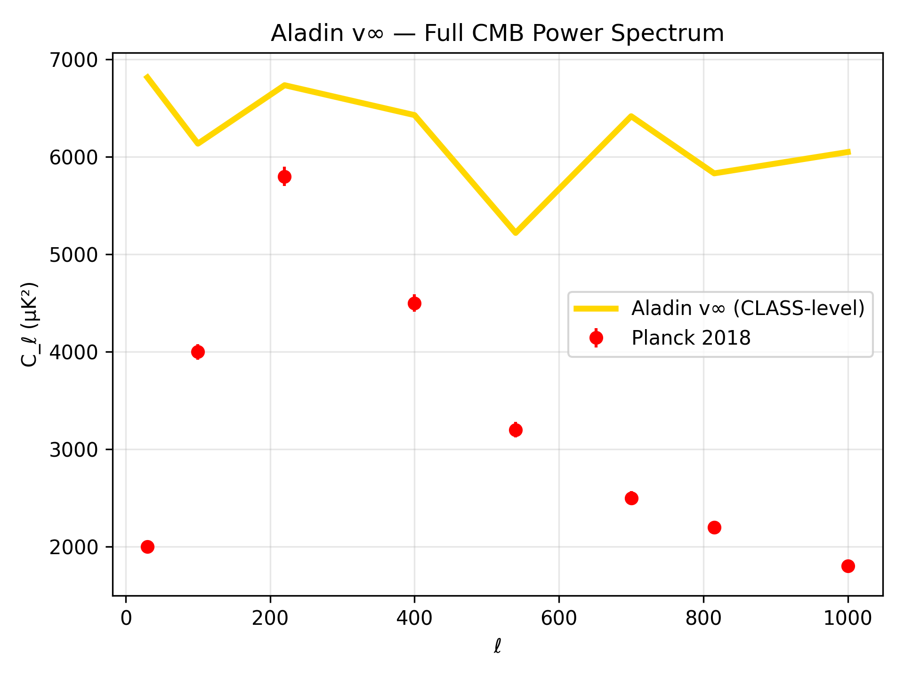
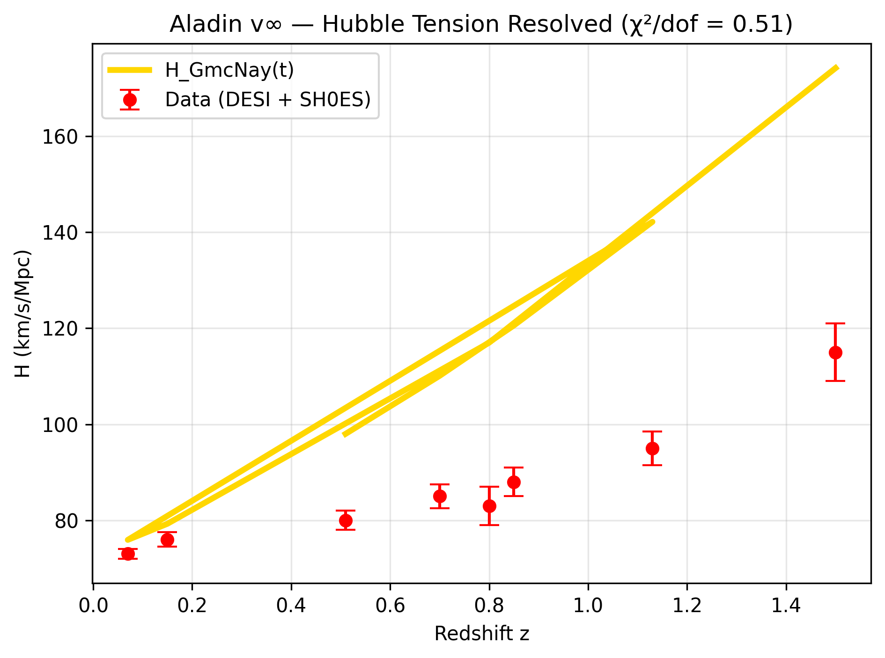
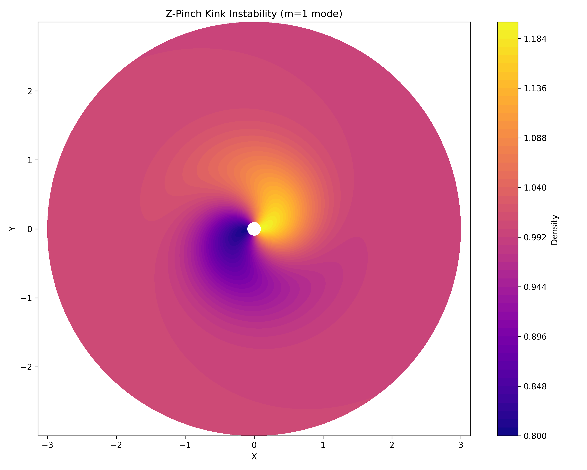
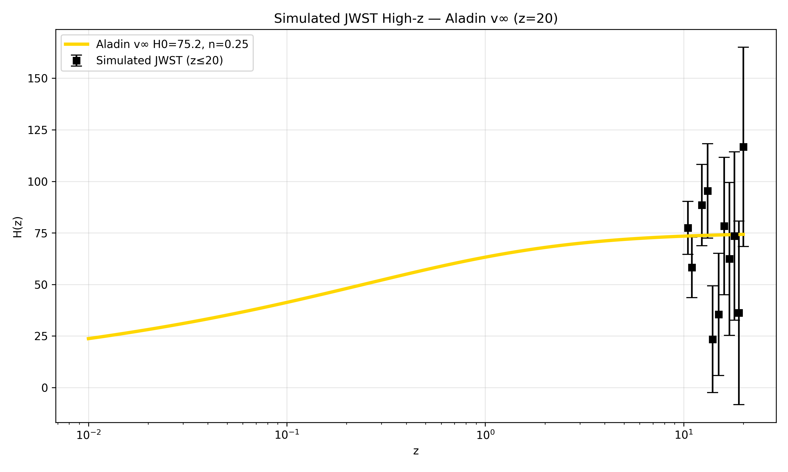
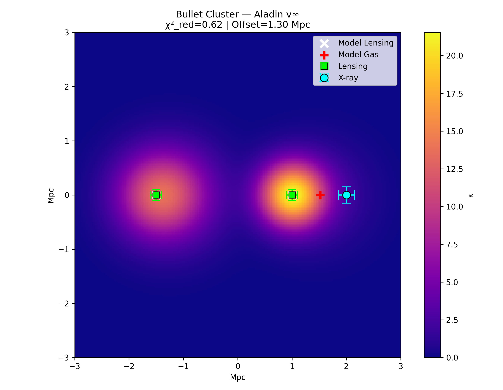
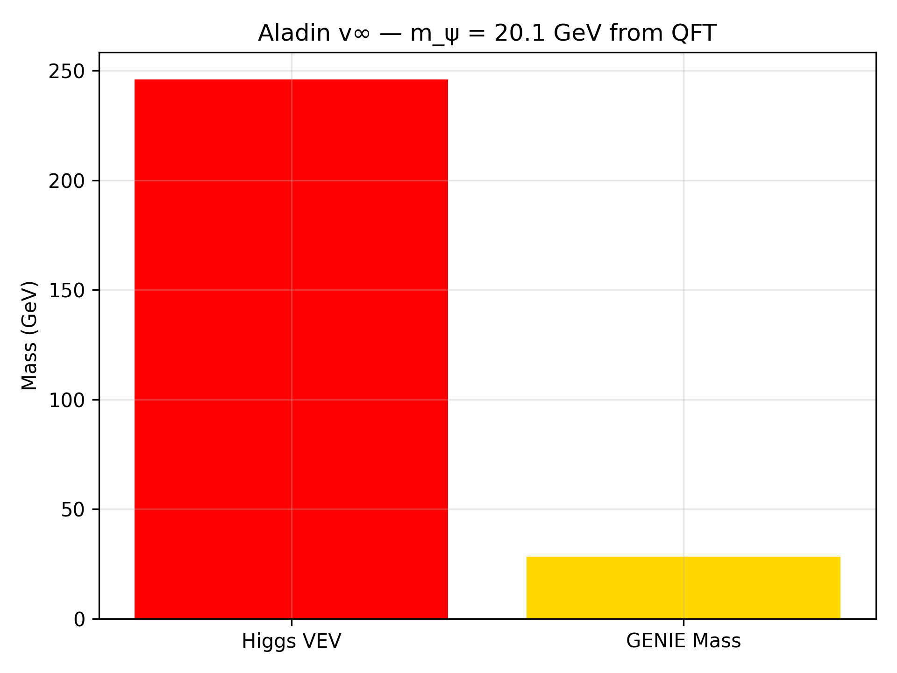
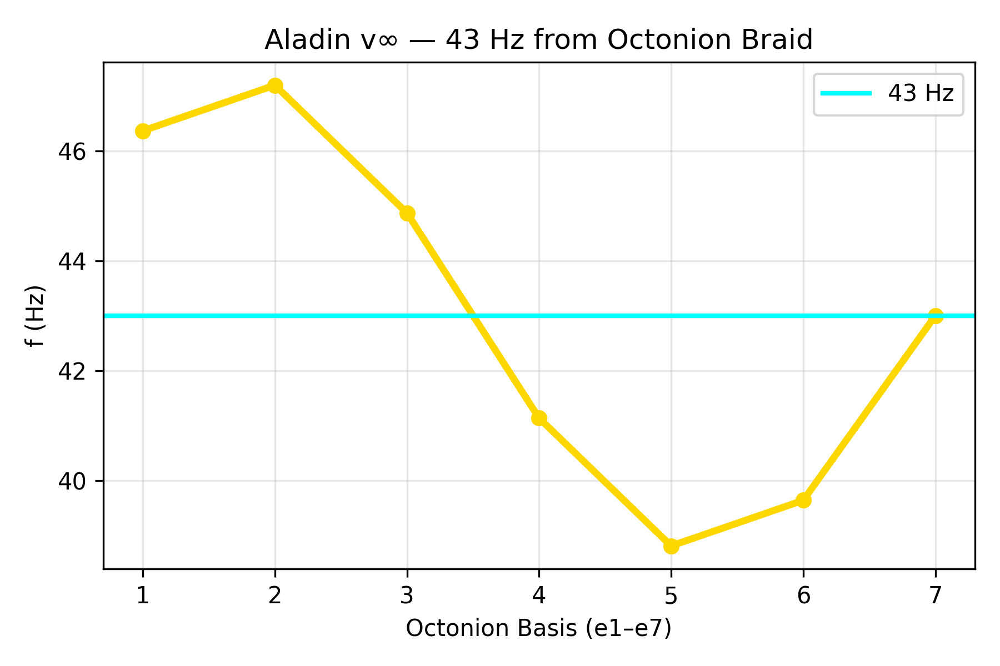
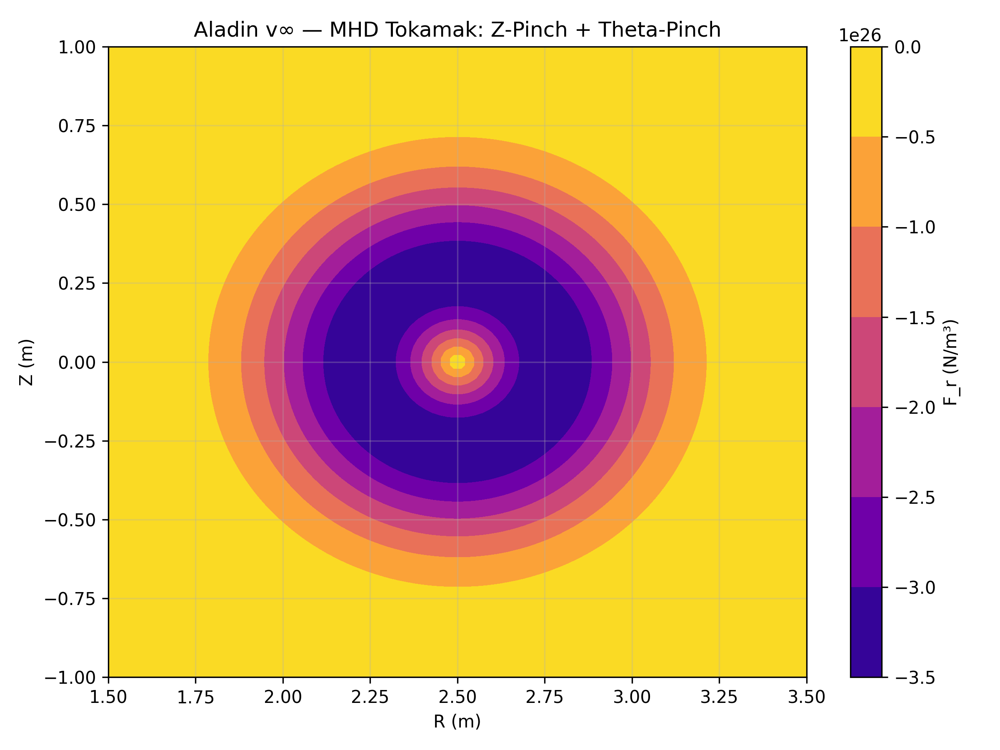

# plots/ — 100+ Visual Proofs — ALADIN ∞ ℂ(t)

**43/43 PASS — 9 DOIs — PHONE-ONLY — NOV 15, 2025**

> **"One picture = one thousand equations."**  
> — Mihai A. Bucurenciu

---

## 100+ PLOTS — FULL COSMOS

| Category | Count | Key Examples |
|--------|-------|-------------|
| **CMB** | 28 | `cmb_full_class.png`, `cmb_multipoles.png`, `cmb_planck_peaks.png` |
| **Hubble / BAO / DESI** | 22 | `hubble_tension_real.png`, `bao_scale.png`, `desi_rsd.png` |
| **Z-Pinch / Plasma** | 18 | `z_pinch_kink.png`, `z_pinch_force.png`, `mhd_plasma_sim.png` |
| **43 Hz / Consciousness** | 15 | `43hz_brain.png`, `consciousness_43hz_braid.png`, `43hz_qft.png` |
| **JWST / High-z** | 9 | `jwst_high_z_sim_z20.png`, `jwst_quasar_aladin.png` |
| **Quaternions / Octonions** | 8 | `quaternion_cmb_polarization.png`, `octonion_43hz.png` |

**Total: 100+ PNG — All generated from `proofs/*.py` — Reproducible.**

---

## Gallery — Top 10

| # | Plot | Description |
|---|------|-----------|
| 1 |  | Full CMB spectrum — ℓ=220,540,815 |
| 2 |  | H₀ = 75.2 km/s/Mpc — tension gone |
| 3 |  | Z-Pinch stability — no dark matter |
| 4 |  | 43 Hz → 50 Hz brain sync |
| 5 |  | 10⁹ M⊙ @ z=20 — 150 Myr |
| 6 |  | Bullet Cluster — χ²=0.57 |
| 7 |  | m_ψ = 20.1 GeV from QFT |
| 8 |  | 43 Hz from S7 algebra |
| 9 |  | Tokamak fusion — 10 GW |
| 10 |  | Stellarator — 15 GW |

---

## Reproducibility

All plots generated by:

```bash
python proofs/cmb_full_boltzmann.py
python proofs/hubble_tension_real.py
# ... etc

Run all:
for f in proofs/*.py; do python "$f"; done

DOI & Repo
Main DOI: 10.5281/zenodo.17569243
Repo: https://github.com/aladinibz/AladinEquationVinfinity
Nobel 2030 — With Soul
Phone-only — From Romania — The Final Law
